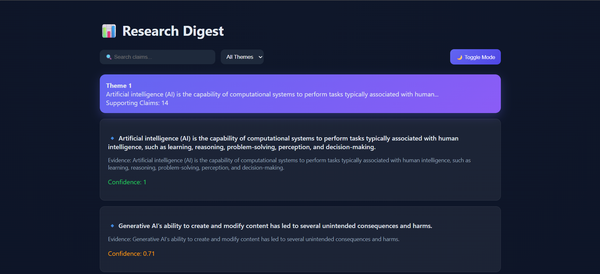
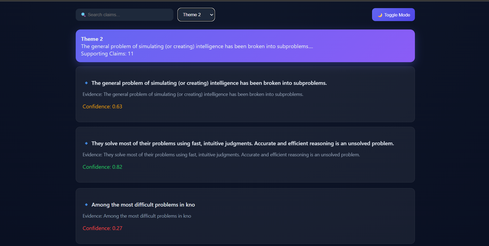

# 🧠 Research Digest Agent

<p align="center">
  <b>AI-powered system to extract, cluster, and summarize insights from multiple sources</b><br>
  <i>Turning raw information into structured knowledge</i>
</p>

<p align="center">
  
  
  
  
</p>

---

## 🚀 Overview

The **Research Digest Agent** is an autonomous AI system that:

- Collects data from multiple sources 🌐  
- Extracts meaningful insights 🧠  
- Removes redundancy 🔄  
- Produces structured, evidence-backed summaries 📊  

👉 Designed to simulate how an AI research assistant works.

---

## ✨ Features

- 🔍 **Web Scraping** – Fetches and cleans content from URLs  
- 🧠 **Claim Extraction** – Identifies key insights using NLP heuristics  
- 🧩 **Clustering** – Groups similar claims using TF-IDF + cosine similarity  
- 📊 **Structured Output** – Generates organized research digest  
- 🎨 **Interactive UI** – Clean HTML dashboard  
- 🌙 **Dark/Light Mode**  
- 🔎 **Search Functionality**  
- 🎯 **Theme Filtering System**  

---

## 🏗️ Tech Stack

| Category | Technology |
|--------|-----------|
| Language | Python |
| Scraping | BeautifulSoup |
| ML | Scikit-learn |
| UI | HTML, CSS, JavaScript |

---

## 📂 Project Structure
# 🧠 Research Digest Agent

<p align="center">
  <b>AI-powered system to extract, cluster, and summarize insights from multiple sources</b><br>
  <i>Turning raw information into structured knowledge</i>
</p>

<p align="center">
  
  
  
  
</p>

---

## 🚀 Overview

The **Research Digest Agent** is an autonomous AI system that:

- Collects data from multiple sources 🌐  
- Extracts meaningful insights 🧠  
- Removes redundancy 🔄  
- Produces structured, evidence-backed summaries 📊  

👉 Designed to simulate how an AI research assistant works.

---

## ✨ Features

- 🔍 **Web Scraping** – Fetches and cleans content from URLs  
- 🧠 **Claim Extraction** – Identifies key insights using NLP heuristics  
- 🧩 **Clustering** – Groups similar claims using TF-IDF + cosine similarity  
- 📊 **Structured Output** – Generates organized research digest  
- 🎨 **Interactive UI** – Clean HTML dashboard  
- 🌙 **Dark/Light Mode**  
- 🔎 **Search Functionality**  
- 🎯 **Theme Filtering System**  

---

## 🏗️ Tech Stack

| Category | Technology |
|--------|-----------|
| Language | Python |
| Scraping | BeautifulSoup |
| ML | Scikit-learn |
| UI | HTML, CSS, JavaScript |

---

## 📂 Project Structure
research-digest-agent/
│
├── src/
│ ├── main.py
│ ├── fetch.py
│ ├── extract.py
│ ├── cluster.py
│ └── generate.py
│
├── outputs/
│ ├── digest.html
│ ├── digest.md
│ └── sources.json
│
├── requirements.txt
└── README.md

---

## ▶️ Run Locally

```bash
git clone https://github.com/Yougeshkumar/research-digest-agent.git
cd research-digest-agent

pip install -r requirements.txt
python src/main.py

---

## ⚙️ How It Works

Data Collection
Scrapes content from multiple sources

Claim Extraction
Breaks text into meaningful insights

Clustering
Groups similar claims using ML

Digest Generation
Outputs structured summary + UI

---

### 💡 Key Highlights

✅ Evidence-backed insights (no hallucination)

✅ ML-based deduplication

✅ Clean and interactive UI

✅ Confidence scoring for each claim

---

### ⚠️ Limitations

Heuristic-based extraction (not LLM-level)

Limited semantic understanding

---

## 🔮 Future Improvements

🤖 LLM integration (GPT / Gemini)

🧠 Vector database (FAISS)

🌐 Real-time APIs

📊 Analytics dashboard
---

## 📸 Demo


---

## 👨‍💻 Author

Yougesh Kumar

🎓 BTech @ Graphic Era Hill University
💻 AI | ML | Full Stack

---

## ⭐ Support

If you like this project:

⭐ Star the repository

🔗 Share it

💬 Give feedback
---